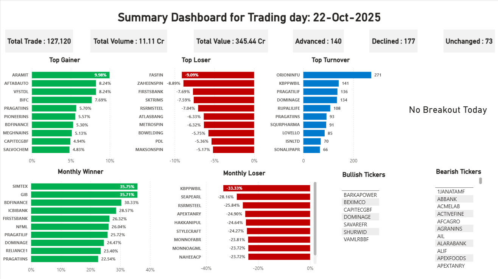
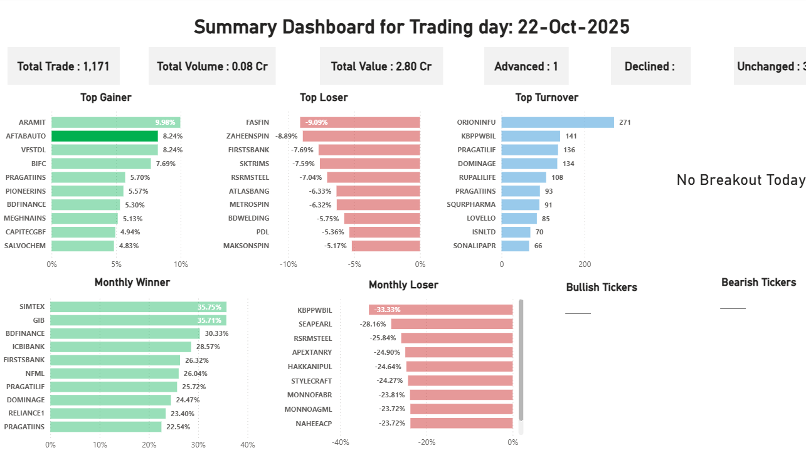

# 📊 Live Trading Dashboard (DSE)
**_End-to-End Pipeline (R → Power BI)_**

> A daily, reproducible pipeline that scrapes Day-End data from the Dhaka Stock Exchange (DSE), updates per-ticker history, computes analytics, and visualizes performance in Power BI.

---

## 🗂️ Repository Structure
```plaintext
Trading-Dashboard/
├── README.md
├── trade_dashboard.pbix               # Power BI dashboard (optional; can be .gitignored)
├── daily_task.ipynb                   # Notebook orchestrating daily updates (calls R script)
├── data_updater.R                     # Core R scraper & data updater
├── Scrapped_data/
│   └── daily/                         # Per-ticker historical CSVs updated daily
├── trade_data.csv                     # Consolidated dataset consumed by Power BI
└── images/
    ├── Dashboard_overview.png
    └── Selected_utility.png


---

## ⚙️ Project Overview

1. **Scrape** daily day-end tables from DSE using an R script.  
2. **Update per-ticker historical CSVs** under `Scrapped_data/daily/`.  
   - If a ticker didn’t trade today, fill a new row using the previous close (`volume = 0`, `trade = 0`) within a 7-day window.  
   - Replace zero `open`, `high`, or `low` values with the previous `close`.  
3. **Compute analytics** in R:  
   - 250-day breakouts  
   - Bullish/Bearish signals (EMA(10) vs SMA(10))  
   - 20-day returns (“monthly” proxy)  
   - Daily returns  
4. **Export `trade_data.csv`** — the unified dataset used by Power BI.  
5. **Visualize** in Power BI with dynamic DAX measures that automatically update with each new trading day.

---

## 🧾 R — Libraries Used

`data_updater.R` and the notebook use:

| Library | Purpose |
|----------|----------|
| **rvest** | HTML parsing & scraping (DSE archive pages) |
| **dplyr** | Data manipulation (rename, mutate, bind, filter) |
| **readr** | Fast CSV I/O |
| **lubridate** | Date parsing & arithmetic |
| **stringr** | String cleaning |
| **purrr** | Functional iteration over tickers |
| **TTR** | Technical indicators (EMA, SMA) |

---

## 🔍 Key R Functions

### `scrap_data_updater(last_day)`
- Scrapes DSE archive for `last_day`.  
- Cleans numeric columns and appends rows to each ticker’s CSV.  
- Creates missing rows for inactive tickers (within 7 days).  

### `replace_zero_with_close(folder_path)`
- Replaces `open`, `high`, or `low` values of zero with the previous day’s `close`.  

### Analytics Helpers
- **`check_breakout(ticker)`** → `TRUE` if `close_today > max(last 249 closes)`  
- **`check_bullish(ticker)`** → `TRUE` if `EMA(10)` > `SMA(10)` for recent days  
- **`check_bearish(ticker)`** → opposite condition  
- **`calc_20day_return(ticker)`** → `(close_today / close_20days_ago) - 1`  
- **`calc_daily_return(ticker)`** → `(close_today / close_prev_day) - 1`  

**Final output:** `trade_data.csv`, used directly in Power BI.

---

## ⚡ Power BI Dashboard

The Power BI report reads `trade_data.csv` and refreshes automatically when the file updates.

### 🔸 Header
```DAX
TradingDay =
"Summary Dashboard for Trading day: " &
FORMAT(FIRSTNONBLANK(trade_data[date], 1), "dd-MMM-yyyy")
````

### 🔸 KPI Cards

**Total Trade**

```DAX
TotalTrade =
"Total Trade : " & FORMAT(SUM(trade_data[trade]), "#,##0")
```

**Total Volume (Cr)**

```DAX
TotalVolume =
"Total Volume : " & FORMAT(DIVIDE(SUM(trade_data[volume]), 10000000), "0.00") & " Cr"
```

**Total Value (Cr)**

```DAX
TotalValue =
"Total Value : " & FORMAT(DIVIDE(SUM(trade_data[value]), 10), "0.00") & " Cr"
```

### 🔸 Breadth Indicators

**Advanced**

```DAX
Total_Advance =
"Advanced : " &
FORMAT(
    CALCULATE(
        COUNTROWS(trade_data),
        FILTER(trade_data, VALUE(trade_data[DailyReturn]) > 0)
    ),
"#,##0")
```

**Declined**

```DAX
Total_Declined =
"Declined : " &
FORMAT(
    CALCULATE(
        COUNTROWS(trade_data),
        FILTER(trade_data, VALUE(trade_data[DailyReturn]) < 0)
    ),
"#,##0")
```

**Unchanged (auto-corrected)**

```DAX
Total_Unchanged =
"Unchanged : " &
FORMAT(
    COUNTROWS(trade_data)
    - COUNTROWS(FILTER(trade_data, VALUE(trade_data[DailyReturn]) > 0))
    - COUNTROWS(FILTER(trade_data, VALUE(trade_data[DailyReturn]) < 0)),
"#,##0")
```

### 🔸 Visuals

* **Top 10 Gainers / Losers** — bar charts sorted by `DailyReturn` (Top N = 10).
* **Top Turnover** — sorted by `trade` or computed turnover.
* **Monthly Winners / Losers** — bar charts based on `MonthlyReturn`.
* **Breakouts** — shows tickers where `Breakout = TRUE`; displays “No Breakout Today” if none:

```DAX
Breakout_Today =
VAR CountBreakout = COUNTROWS(FILTER(trade_data, trade_data[Breakout] = TRUE()))
RETURN IF(CountBreakout = 0, "No Breakout Today", "Breakouts Today: " & CountBreakout)
```

* **Bullish / Bearish tickers** — table visuals filtered on `Bullish = TRUE` or `Bearish = TRUE`.

---

## 🖼️ Dashboard Preview

| Overview                                             | Utility                                                 |
| ---------------------------------------------------- | ------------------------------------------------------- |
|  |  |

---

## ▶ How to Run Locally

1. **Install R dependencies**

```r
install.packages(c("rvest","dplyr","readr","lubridate","stringr","purrr","TTR"))
```

2. **Scrape and update data**

```r
source("scripts/data_updater.R")
scrap_data_updater("2025-10-22")  # Example date (YYYY-MM-DD)
```

3. **Execute daily pipeline (via Jupyter Notebook)**

   * Calls the R script
   * Fills missing tickers
   * Computes breakout, bullish/bearish, and returns
   * Exports `data/trade_data.csv`

4. **Open Power BI**

   * Load `trade_data.csv`
   * Ensure:

     * `DailyReturn`, `MonthlyReturn` → *Decimal Number*
     * `date` → *Date* type
   * Press **Refresh** to update visuals.

---

## 👤 Author

**Mehedi Hasan Ahmed** — Quantitative Analyst
📧 [mehedi24434@gmail.com](mailto:mehedi24434@gmail.com)
🔗 [LinkedIn Profile](https://www.linkedin.com/in/mehedi-hasan-ahmed-1a2b3c4d5/)

---

## 🧾 Acknowledgements

* DSE Day-End Archive
* `rvest`, `dplyr`, and `TTR` — for simplifying scraping and analysis workflows

---

*© 2025 Mehedi Hasan Ahmed — Educational and analytical use only.*

```


